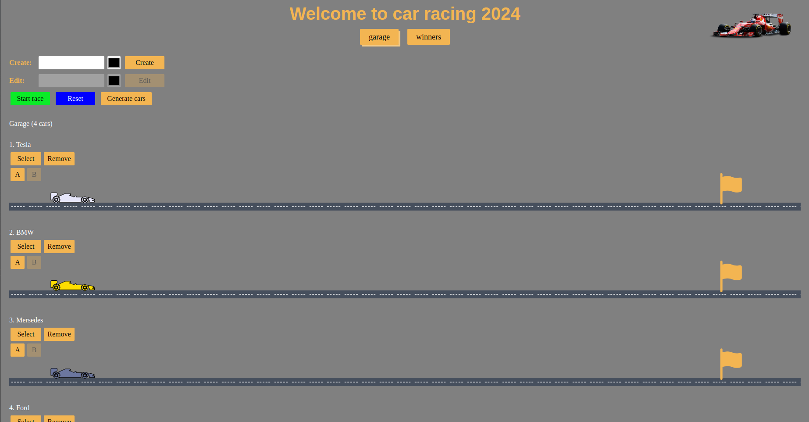

# Async Race Project

[UI Deployment Link](https://async-race2.vercel.app/) (Score: 395/405)

## Checklist

- [x] UI Deployment
- [x] Garage View Configuration
- [x] Garage View Functionality
- [x] Car Animation
- [x] Race Animation
- [x] Winners View
- [x] Application Architecture
- [x] Dynamic Content Generation
- [x] Single Page Application
- [x] Bundling and Tooling
- [x] Code Quality and Standards
- [x] Code Organization and Efficiency
- [x] Prettier and ESLint Configuration
- [x] Overall Code Quality

## Screenshot:

## Key skills

TypeScript
Modules in JavaScript
Webpack
Сommunication with a server (fetch, REST API)
Async coding / Promises
JS Animations
DOM Api

## How to Run

Backend code run:

1. Use node 14.x or higher.
2. Clone this repo: $ git clone https://github.com/mikhama/async-race-api.git.
3. Go to downloaded folder: $ cd async-race-api.
4. Install dependencies: $ npm install.
5. Start server: $ npm start.
6. Now you can send requests to the address: http://127.0.0.1:3000.

Frontend code run:

1. Clone this repo: $ git clone https://github.com/achiewe/async-race.git.
2. Go to downloaded folder: $ cd async-race.
3. Install dependencies: $ npm install.
4. Start server: $ npm start.
